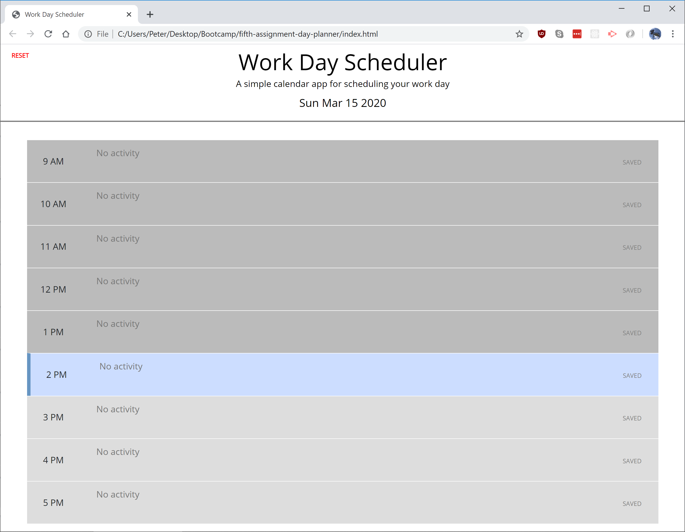
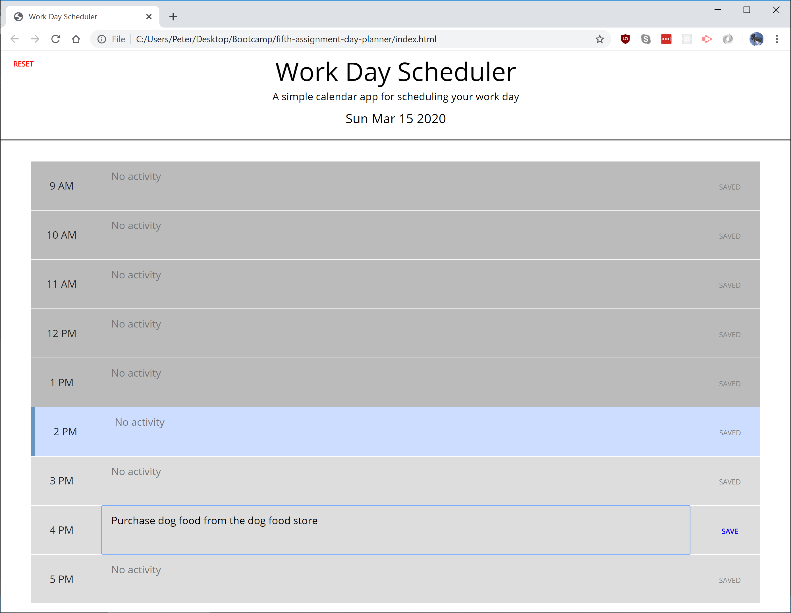
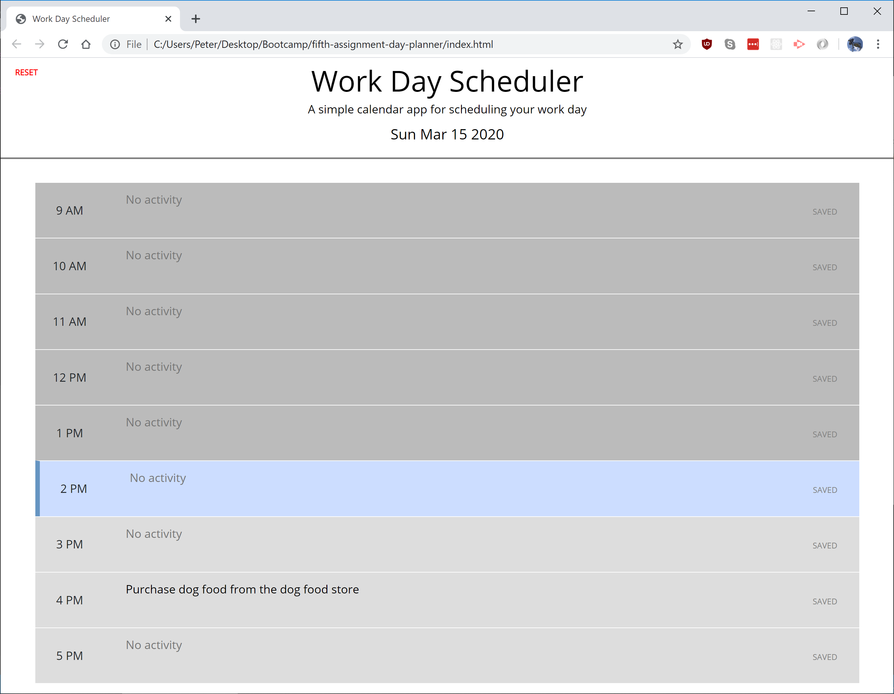

# Assignment 5: jQuery Day Planner

### A simple calendar app for planning daily acitvities

The app defaults with no activities. Past times are shown in darker grey, while the current time is accented in blue. The current date is shown at the top.

Upon changing any cell, the user sees that they can save thier changes.

The user can click save to save the changes. These changes are retained when the page is refreshed. The user can also press 'reset' in the top-left corner to erase all saved info.

## Link to live site: https://petertyliu.github.io/fifth-assignment-day-planner/index.html
